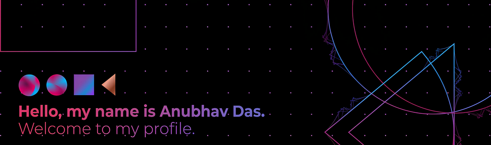

## About me

- **Electronics & Communication Engineering Student** @ [FOT - University of Delhi](https://www.iiit.ac.in).
- **Published Researcher** in *Applied AI for Healthcare* - Co-Author of [The Transpaernt Heart: XAI in Cardiology](https://shop.elsevier.com/books/explainable-ai-in-clinical-practice/mallik/978-0-443-45374-8) 
- **Interests**: Edge AI/ML • Robotics • VLSI • Applied Machine Learning • Hardware-Software Co-Designing

I love building things that sit at the intersection of hardware and AI — from compilers that squeeze ML models onto edge silicon, to wearable biosensors that turn raw signals into clinical-grade insights. When I'm not deep in Verilog or Python, I'm probably reading about the latest in edge computing or tinkering with a new Raspberry Pi project. Let's connect and build something great together!

## Technical skills

### Programming Languages

### Hardware & VLSI

### AI / ML & Frameworks

### Tools & Infrastructure

## Featured Projects
 
- 🛡️ **[SentinelRAG](https://github.com/Anu13lol/sentinelRAG)** — Enterprise AI auditor with dual-stage LLM validation (heuristic + Gemini 2.5 judge), weighted trust scoring, and a prompt-injection firewall.
- 🔍 **[VerifAI](https://github.com/verifAI)** — High-throughput media piracy detection engine with a custom C++17 perceptual hashing core achieving 200+ FPS and a 65× Python speedup, deployed on Cloud Run.
- ❤️ **[Real-Time Wearable Biosensor](https://github.com/Anu13lol/Real-Time-AI-Biosensor)** — Clinical-grade ECG/PPG monitoring on Raspberry Pi with real-time DSP for noise rejection, achieving ~60% SNR improvement and <200ms latency.
- 🧠 **NeuroVolt** — Hardware-aware mixed-precision (INT8/FP16) ML compiler for AMD XDNA NPUs, achieving >40% memory footprint reduction and 1.8× inference throughput. *(AMD Developer Hackathon 2026)*

## Research & Open Source
 
- 📄 **The Transparent Heart: Explainable AI in Cardiology** — Co-authored book chapter on XAI for ECG interpretation and clinical risk stratification *(Elsevier, accepted/forthcoming)*
- 📈 **AI-Driven Patient Monitoring via Time-Series Analysis** — LSTM-based HRV forecasting with <2% MAE, supervised by Dr. Vanita Jain

## Connect with me
 

&nbsp;

&nbsp;

&nbsp;

 

  
  &nbsp;&nbsp;&nbsp;&nbsp;&nbsp;
  
  &nbsp;&nbsp;&nbsp;&nbsp;&nbsp;
   
  <i>Building at the edge — one chip, one model, one signal at a time ⚡</i>

